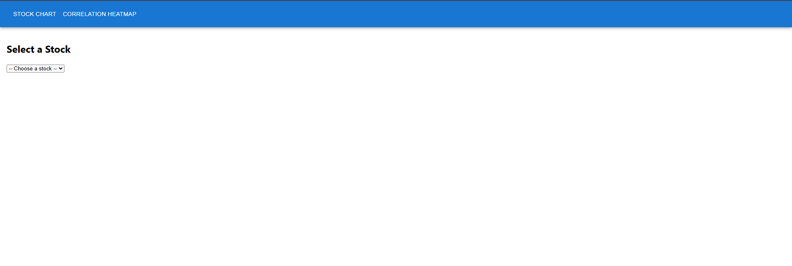
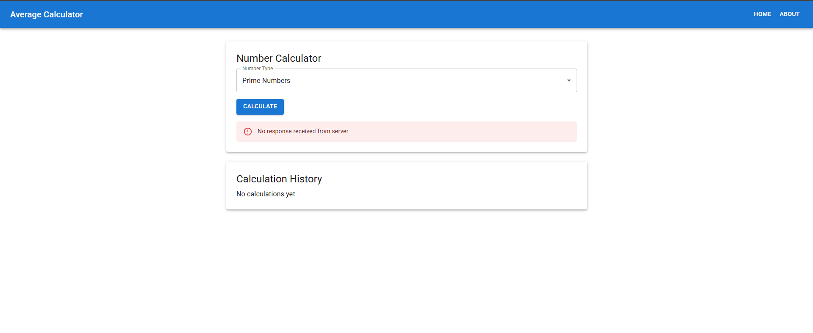

# CB.EN.U4CSE22518

## Stock Price Aggregator and Average Calculator Microservice

This project consists of two main components: a **Stock Price Aggregator** and an **Average Calculator Microservice**.

---

## Question 1: Stock Price Aggregator

In this section, the application allows users to select a stock from a dropdown list and view its price history over the last 50 minutes. The stock data is retrieved from the backend API and visualized on a line chart.

### Screenshots:

1. **Stock Chart Page:**

   
   _This screenshot demonstrates the Stock Chart page where users can select a stock and view its price history._

## Question 2: Average Calculator HTTP Microservice

In this section, a microservice is implemented that calculates the average of numbers fetched from a third-party API. The microservice exclusively accepts qualified number IDs: 'p' for prime, 'f' for Fibonacci, 'e' for even, and 'r' for random numbers. It uses a window size for storing and calculating averages, ensuring quick responses and maintaining the window size limit.

The API ensures that if the window size is breached, the oldest number is replaced by the newest number, and the average is calculated based on the current numbers in the window.

### Screenshots:

1. **Average Calculator Service in Action:**

   
   _This screenshot shows the Average Calculator HTTP microservice running and processing requests to calculate averages._

## Installation

To run this project locally:

1. Clone the repository:

   ```bash
   git clone <repository-url>
   ```

2. Install dependencies:

   ```bash
   npm install
   ```

3. Start Development server:
   ```bash
   npm start
   ```
